# Симулятор колебаний

> *Входные данные:*
>
>**1. Начальные условия маятника**
>
>**2. Промежуток времени движения**
>
>**3. Модель осциллятора (уравнение)**
>
>**4. Метод решения уравнения движения**


>*Выходные данные:*  
>
>**Траектория движения маятника, изображенная на графике** 

**Поддерживаемые модели осциллятора**

* *Математический маятник*
* *Физический маятник*
* *Математический маятник с трением*
* *Математический маятник с вынуждающей силой (и трением)*

**Траектории рассчитываются**

* *Аналитически*
* *Методом Эйлера*
* *Методом Хойна*
* *Методом Рунге-Кутты(4)*


# Содержание

[1. Способы задания уравнений движения](#1)

Немного теории

Используемые в программе модели осцилляторов

[2. Методы решения уравнений движения](#2)

Используемые итерационные схемы

[3. Амплитудно-частотная характеристика](#5)

Сревнение результатов с теоретической АЧХ

[4. Сравнение всех методов с точки зрения ЗСЭ](#3)

Результаты по замерам зависимостей удельной энергии системы от времени

[5. Запуск](#4)

Коротко о том, как работают программы

Пример написания конфигурационного файла и запуска


<a name="1"></a>
## Способы задания уравнений движения

**Уравнение колебаний**

В общем случае на маятник могут действовать вынуждающие силы и силы вязкого трения, поэтому все уравнения движения математического маятника представимы в виде диффура второго порядка:

**$$A(X) \ddot{X} + B(X) \dot{X} + C(X)X + D(X) = 0$$**
 
> **Главным и единственным требованием для того, чтобы получить решение какого-либо уравнения является его способность выдать производную в любой момент времени**

Так, описывая систему столбцом координат  z = (t, x, v) можно получить состояние (координату и скорость) в любой момент времени. Для этого мы сводим решение дифференциального уравнения любой степени n к решению системы из n уравнений первой степени.

----------------------------------------------------------------------------------------
### 1. Математический маятник

> *На его примере рассчитываются все методы решения*

Частным случаем движения являются **гармонические колебания** математического маятника, описываемые следующим уравнением:

**$$\ddot{X} + \omega^2X = 0$$**
 
где $\omega^2 = \frac{C}{A} , \omega -$ частота колебаний осциллятора.

Для сведения уранения к первой степени, сделаем замену $\dot{X} = V$

Приходим к системе уравнений вида:

**$$\dot{X} = V$$**

**$$\dot{V} = - \omega^2 X$$**

Сделаем замену z = (t, x, v).

Тогда возвращаемое значение производной в конкретном состоянии z будет следующим:

**$$z'_t = f(z) = (1, x'_t,  v'_t)^T = (1, v, -\omega^2 x)^T$$**

----------------------------------------------------------------------------------------
### 2. Физический маятник

> *Его поведение можно получить теми же численными методами, которые будут рассмотрены для математического маятника*

Уравнение движения имеет вид:

**$$\ddot{X} + \omega^2 sin(X) = 0$$**

Сделаем замену $\dot{X} = V$

Приходим к системе уравнений вида:

**$$\dot{X} = V$$**

**$$\dot{V} = - \omega^2 sin(X)$$**

Сделаем замену z = (t, x, v).

Тогда возвращаемое значение производной в конкретном состоянии z будет следующим:

**$$z'_t = f(z) = (1, x'_t, v'_t)^T = (1, v, -\omega^2 sin(x))^T$$**

----------------------------------------------------------------------------------------
### 3. Математический маятник с вязким трением

> На тело, движущееся в среде, действует сила трения, которая зависит от скорости
>
> **$F_{tr} = -\beta v$**, **$\beta$**- положительный постоянный коэффициент

С учетом силы трения уравнение движения примет вид:

**$$\ddot{X} + 2\delta \dot{X} + \omega^2 X = 0$$**

Тогда приходим к системе уравнений вида:

**$$\dot{X} = V$$**

**$$\dot{V} = -2 \delta V - \omega^2 X$$**

Возвращаемое значение производной в конкретном состоянии z = (t, y) будет следующим:

**$$z'_t = f(t, y) = f(z) = (1, x'_t, y'_t)^T = (1, v, -2 \delta v -\omega^2 x)^T$$**

----------------------------------------------------------------------------------------
### 4. Математический маятник с вынуждающей силой

> *Кроме того на тело может действовать вынуждающая сила, разным образом зависящая от времени и координат*
> *В простейшем случае эта сила гармоническая*

**$$F_v = F cos(\omega_0 T)$$**

Тогда уравнение движения примет вид:

**$$\ddot{X} + 2\delta \dot{X} + \omega^2 X = F cos(\omega_0 T)$$**

**$$\dot{X} = V$$**

**$$\dot{V} = -2 \delta V - \omega^2 X + F cos(\omega_0 T)$$**


<a name="2"></a>
## Методы решения уравнений движения

### 1. Аналитический

> *Аналитическое решение уравнения колебаний*

**Общий вид решения гармонических колебаний:**


**$$X = C_2 cos(\omega T) + C_1 sin(\omega T),$$**

**$$U = - C_2 \omega sin(\omega T) + C_1 \omega cos(\omega T)$$**

 
где постоянные зависят от начальных условий (задается произвольное начальное время $T_0$ и координаты $X_0, U_0$):

$$C_1 = X_0 W sin(W T_0) + \frac{U_0}{W} cos(W T_0)$$
$$C_2 = X_0 W cos(W T_0) - \frac{U_0}{W} sin(W T_0)$$ 


**Расчет и изображение траектории**

Для заданных начальных условий и промежутка времени
$$\omega$$ | $$X_0$$ | $$V_0$$ | $$T_1$$ | $$T_2$$ | $$\Delta{T}$$ 
------|:--------:|------|:--------:|---------|:--------:|
10    | 5     | 10  | 0 | 5 | 0.01


Траектория имеет следующий вид:

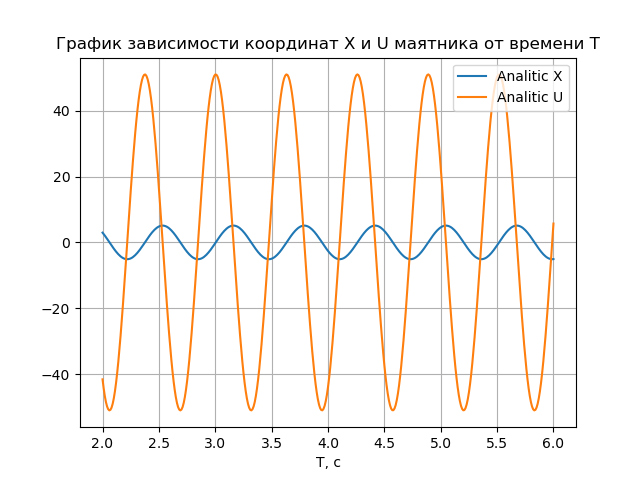

#### Добавление вязкости в систему

Добавление вязкости очевидным образом сказывается на колебаниях:

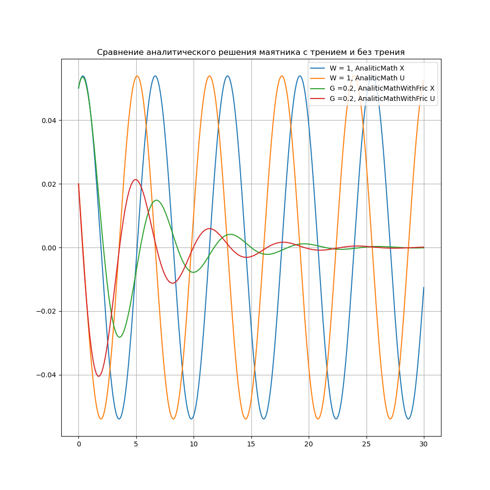

Но интересно исследовать поведение системы при **различных соотношениях** между **частотой W** и **коэффициентом затухания G**.

Теперь решение разбивается на три случая:

##### 1. Затухание больше частоты **$\delta > \omega$**

$$X = e^{-\delta t}(C_1 e^{\alpha t} + C_2 e^{-\alpha t})$$
$$V = -\delta e^{-\delta t}(C_1 e^{\alpha t} + C_2 e^{-\alpha t}) + e^{-\delta t}(\alpha C_1 e^{\alpha t} - \alpha C_2 e^{-\alpha t})$$

$$\alpha = \sqrt{\delta^2 - \omega^2}$$

$C_1 = \frac{V_0 + (\delta + \alpha)X_0}{2\alpha}, C_2 =\frac{-V_0 + (-\delta + \alpha)X_0}{2\alpha}$ - константы, зависящие от начальных условий.

Здесь отсутствуют колебания: **скорость быстро падает и система медленно приходит в начальное состояние**.

##### 2. Затухание меньше частоты **$\delta < \omega$**

$$X = e^{-\delta t}(C_1cos(\omega_0 t) + C_2sin(\omega_0t))$$
$$V = -\delta e^{-\delta t}(C_1cos(\omega_0 t) + C_2sin(\omega_0t)) + \omega_0 e^{-\delta t}(-C_1sin(\omega_0 t) + C_2cos(\omega_0 t))$$

$$\omega_0 = \sqrt{\omega^2 - \delta^2}$$
$C_1 = X_0, C_2 = \frac{V_0 + \delta X_0}{\omega_0}$ - константы, зависящие от начальных условий.

Здесь есть **затухающие колебания**.

##### 3. Затухание и частота равны **$\delta = \omega$**

$$X = e^{-\delta t}C_1 + C_2 e^{-\delta t}t$$
$$V = -\delta e^{-\delta t}C_1 - \delta C_2 e^{-\delta t}t + C_2 e^{-\delta t}$$

$C_1 = X_0, C_2 =V_0 + \delta X_0$ - константы, зависящие от начальных условий.

Здесь система совершает **одно колебание** и **быстро приходит в положение равновесия**.

Эти поведения наглядно изображены на следующих графиках:

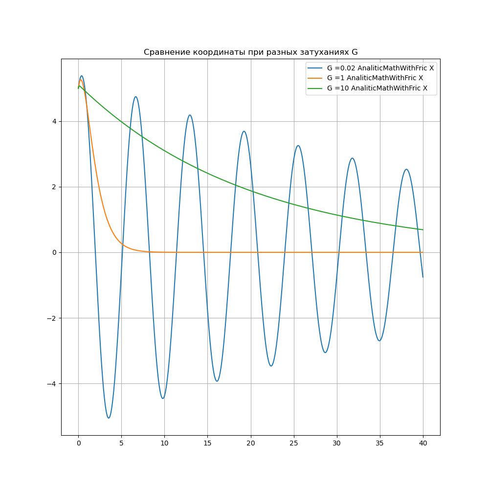
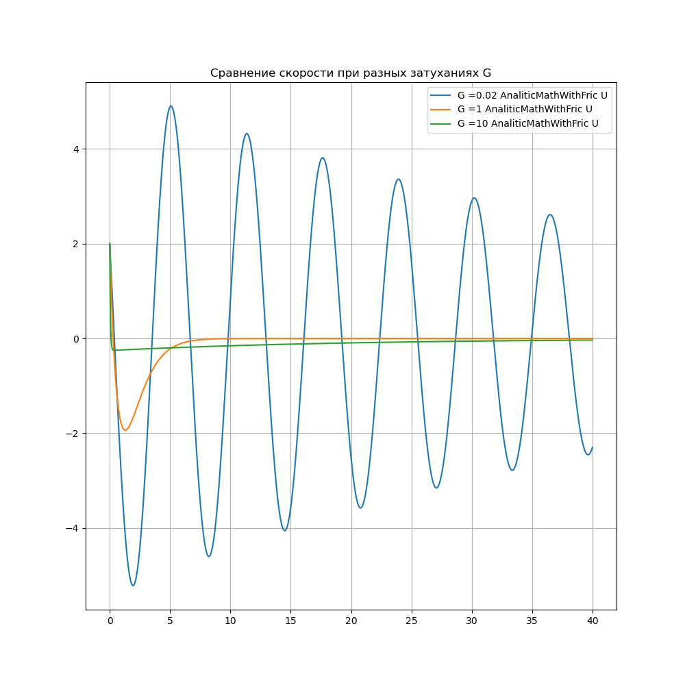

----------------------------------------------------------------------------------------
### 2. Метод Эйлера

> *Итерационный метод решения задачи Коши*

**Общий вид решения**

Для вывода данного метода, воспользуемся разложением функций **X(t)** и **V(t)** в ряд Тейлора:

**$$X(T + \Delta{T}) = X(T) + \dot{X}(T) \Delta{T} + o(\Delta{T})$$**

**$$V(T + \Delta{T}) = V(T) + \dot{V}(T) \Delta{T} + o(\Delta{T})$$**

Учитывая стремление $o(\Delta{T})$ к нулю при уменьшении шага по времени и систему уравнений для производных, приходим к системе вида:

**$$X(T + \Delta{T}) = X(T) + V(T)\Delta{T}$$**

**$$V(T + \Delta{T}) = V(T) -\omega^{2} X(T)\Delta{T}$$**

И, таким образом, можно построить следующий итерационный процесс для вычисления координат в любой промежуток времени T при заданных начальных условиях.

**$$X_{i + 1} = X_{i} + V_{i}\Delta{T}$$**

**$$V_{i + 1} = V_{i} - \omega^{2} X_{i}\Delta{T}$$**
гда
Если сделать замену z = (t, x, v), то задачу можно решать в векторном виде с любыми размерностями:

**$$z'_t = f(t, x, v) = f(z) = (1, x'_t, v'_t)^T = (1, v, -\omega^2x)^T$$**

**$$z_{i+1} = z_i + \Delta{T}f(z_i)$$**

, где **f - та самая волшебная, определенная для всех уравнений, функция, возвращающая производную в любой момент времени.**

**Расчет и изображение траектории**

Для заданных начальных условий и промежутка времени
$$\omega$$ | $$X_0$$ | $$V_0$$ | $$T_1$$ | $$T_2$$ | $$\Delta{T}$$ 
------|:--------:|------|:--------:|---------|:--------:|
10    | 5     | 10  | 0 | 5 | 0.01


Траектория имеет следующий вид:

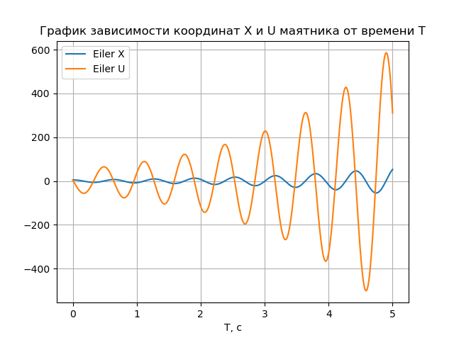


#### Сравнение методa с аналитическим решением


Для заданных начальных условий и промежутка времени
$$\omega$$ | $$X_0$$ | $$V_0$$ | $$T_1$$ | $$T_2$$ | $$\Delta{T}$$ 
------|:--------:|------|:--------:|---------|:--------:|
4    | 4     | 4  | 0 | 8 | 0.01

Видно, что метод Эйлера нарушает *закон сохранения энергии*. Амплитуда колебаний со временем возрастает, чего не может быть без добавления в систему энергии.

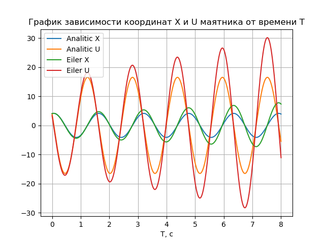

#### Добавление вязкости в систему

Добавляя вязкость можно за счет выбора коэффициента затухания G значительно уменьшить и даже погасить резкое возрастание амплитуды с этом методе, но стабильности так не достичь, нужно добавлять вынуждающую силу...

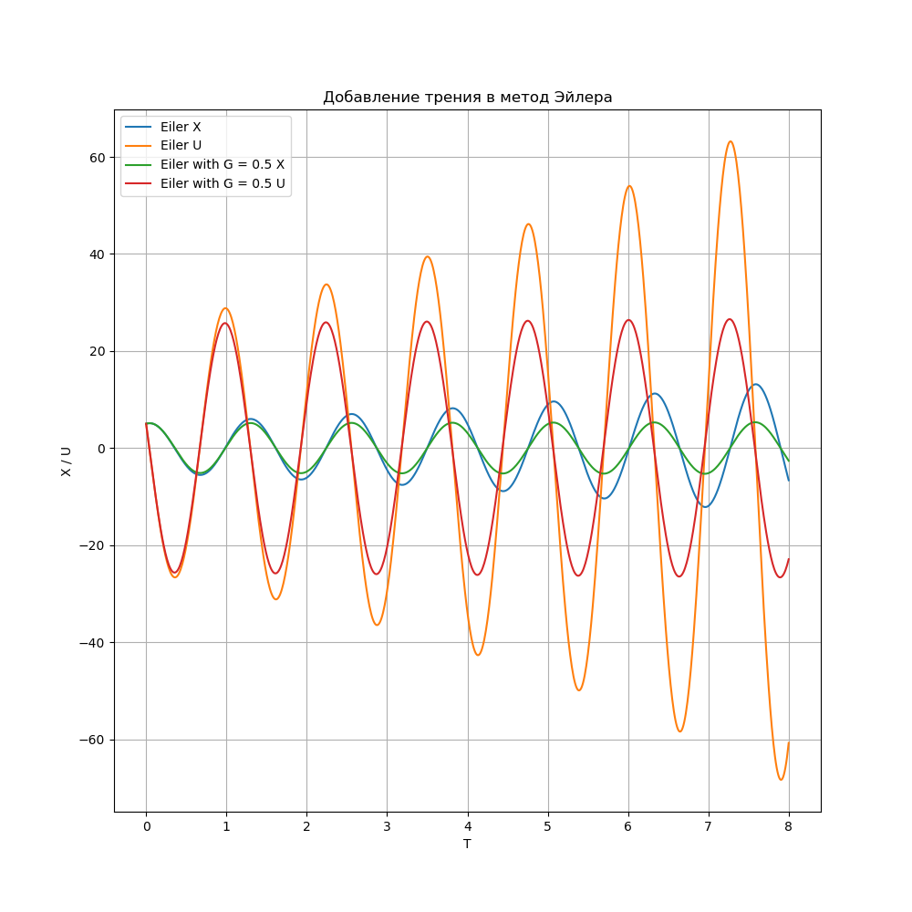

-----------------------------------------------------------------------------------------
### 3. Метод Хойна

> *Данный метод получается из метода Эйлера, но дает более точные результаты*

**Общий вид решения**

Данный метод помогает численно интегрировать уравнения движения с помощью двухэтапного итерационного процесса на основе метода трапеций.

**Метод трапеций** - это среднее арифметическое между явным (i) и неявным (i + 1) методами Эйлера:


**$$X_{i + 1} = X_{i} + \frac{\Delta{T}}{2} (V_{i} + V_{i + 1})$$**

**$$V_{i + 1} = V_{i} - \frac{\Delta{T}}{2} \omega^{2} (X_{i} + X_{i + 1})$$**


Для получения метода Хойна, точные выражения координат на i + 1 - ом шаге заменяют на приближенные, найденные по методу Эйлера. Таким образом, получается двухэтапное вычисление на каждой итерации - **предиктор** и **корректор**:

*Предиктор:*

**$$X_{i + 1}^{'} = X_{i} + \Delta{T} V_{i}$$**

**$$V_{i + 1}^{'} = V_{i} - \Delta{T} \omega^{2} X_{i}$$**

*Корректор:*

**$$X_{i + 1} = X_{i} + \frac{\Delta{T}}{2} (V_{i} + V_{i + 1}^{'})$$**

**$$V_{i + 1} = V_{i} - \frac{\Delta{T}}{2} \omega^{2} (X_{i} + X_{i + 1}^{'})$$**

Если сделать замену z = (t, x, v), то задачу можно решать в веторном виде с любыми размерностями:

**$$z'_t = f(t, x, v) = f(z) = (1, x'_t, v'_t)^T = (1, v, -\omega^2x)^T$$**

**$$z_{i+1}' = z_i + \Delta{T}f(z_i)$$**
**$$z_{i+1} = z_i + \frac{\Delta{T}}{2}(f(z_{i+1}') + f(z_i))$$**


**Расчет и изображение траектории**

Для заданных начальных условий и промежутка времени
$$\omega$$ | $$X_0$$ | $$V_0$$ | $$T_1$$ | $$T_2$$ | $$\Delta{T}$$ 
------|:--------:|------|:--------:|---------|:--------:|
10    | 5     | 10  | 0 | 5 | 0.01


Траектория имеет следующий вид:

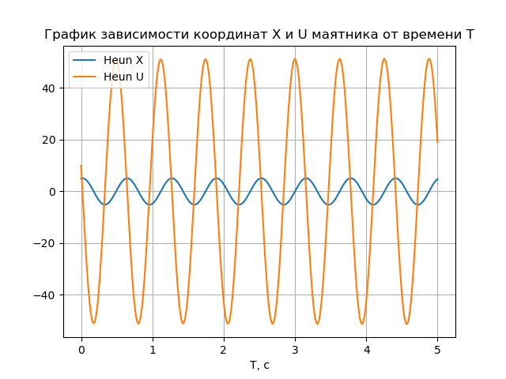


#### Сравнение метода с аналитическим решением

Для заданных начальных условий и промежутка времени
$$\omega$$ | $$X_0$$ | $$V_0$$ | $$T_1$$ | $$T_2$$ | $$\Delta{T}$$ 
------|:--------:|------|:--------:|---------|:--------:|
5   | 5     | 5  | 0 | 2 | 0.01


В данном методе решения с хорошей точностью совпадают с аналитическим.

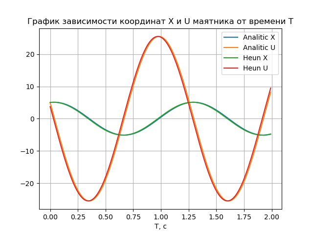

Чтобы обнаружить разницу построим график разности координат и скорости в двух методах. Видно, что решения не совпадают на самом деле.

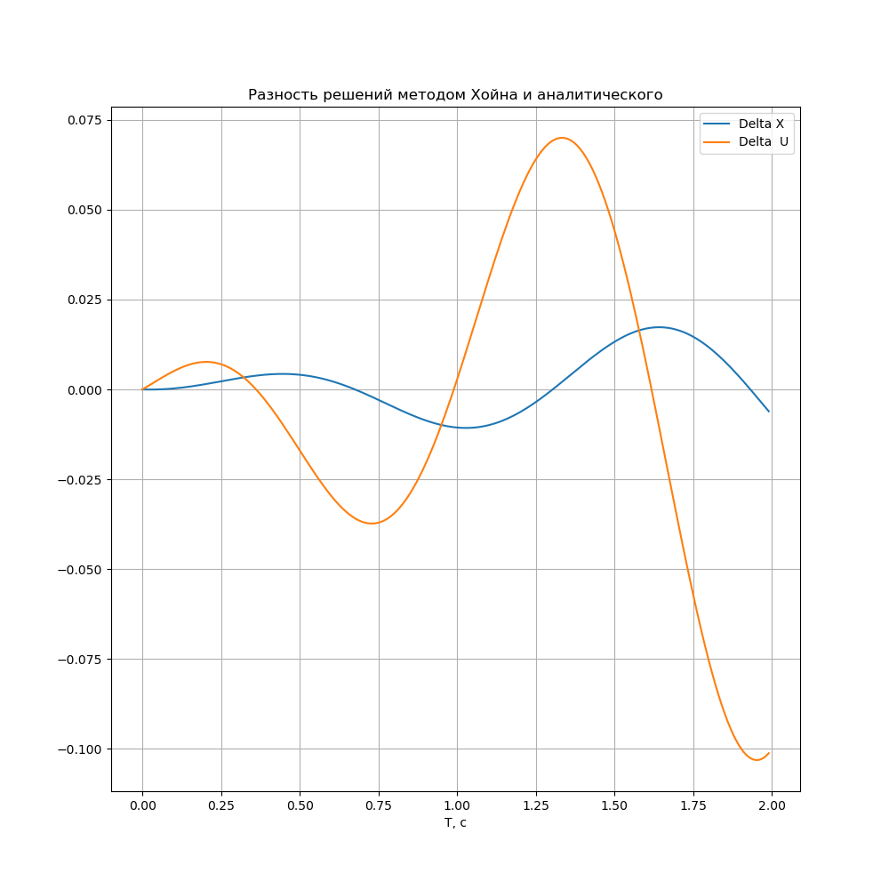


#### Добавление вынуждающей силы в систему

$$\omega_0$$ | $$\delta$$  |F
------|:--------:|--------:|
2   | 0.5     |1


Видно, что на начальном этапе за счет вязкости гасятся колебания на собственной частоте системы и затем устанавливаются колебания на частоте вынуждающей силы.

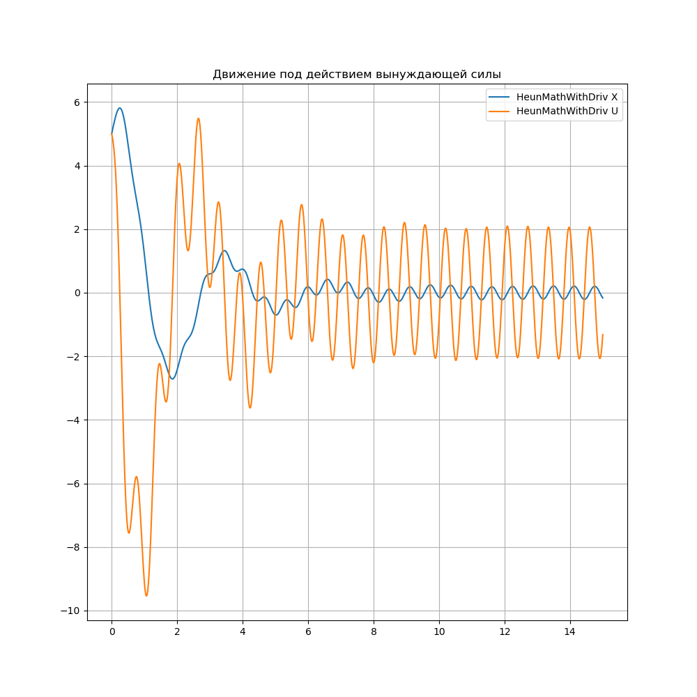

----------------------------------------------------------------------------------------
### 4. Метод Рунге-Кутты(4)

> *Данный метод является методом четвертого порядка точности, его часто называют просто методом Рунге-Кутты*

**Общий вид решения**

Данный метод помогает численно интегрировать уравнения движения с помощью вычисления нового значения в четыре стадии.


Если задать столбец координат: **$y = (x, v)^T$** и нашу задачу Коши: **$y'_t = f(t, y),   y(t_0) = y_0$**  

То итерационная схема метода Рунге-Кутты:

**$$y_{i + 1} = y_{i} + \frac{\Delta{T}}{6} (k_{1} + 2k_2 + 2k_3 + k_4)$$**


, где 

**$$k_1 = f(t, y_i)$$**

**$$k_2 = f(t + \frac{\Delta{T}}{2}, y_i + \frac{\Delta{T}}{2}k_1)$$**

**$$k_3 = f(t + \frac{\Delta{T}}{2}, y_i + \frac{\Delta{T}}{2}k_2)$$**

**$$k_4 = f(t + \Delta{T}, y_i + \Delta{T}k_3)$$**

Сведем к нашей переменной z = (t, y):

**$$z'_t = f(t, y) = f(z) = (1, y'_1, y'_2, ... y'_n)^T$$**

Тогда,

**$$k_1 = f(z_i)$$**

**$$k_2 = f(z_i + \frac{\Delta{T}}{2}k_1)$$**

**$$k_3 = f(z_i + \frac{\Delta{T}}{2}k_2)$$**

**$$k_4 = f(z_i + \Delta{T}k_3)$$**


Метод Рунге-Кутты(4) практически неотличим от аналитического решения, причем отклоняется от него даже меньше предыдущего. 

<a name="5"></a>
#### Добавление вынуждающей силы в систему

Интересно построить **Амплитудно-Частотную Характеристику (АЧХ)** системы - зависимость амплитуды *установившихся* колебаний от частоты вынуждающей силы. 

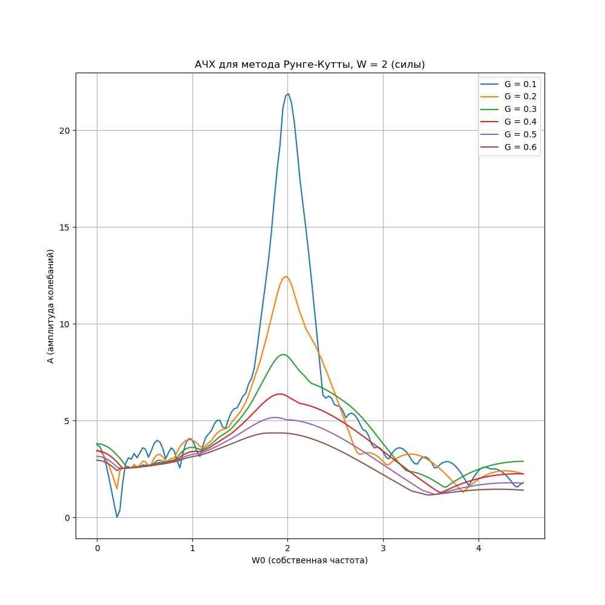


**Аналитический вид АЧХ**:

**$$A = \frac{F}{\sqrt{(\omega^2 - \omega_0^2)^2 + 4\delta^2 \omega_0^2}}$$**

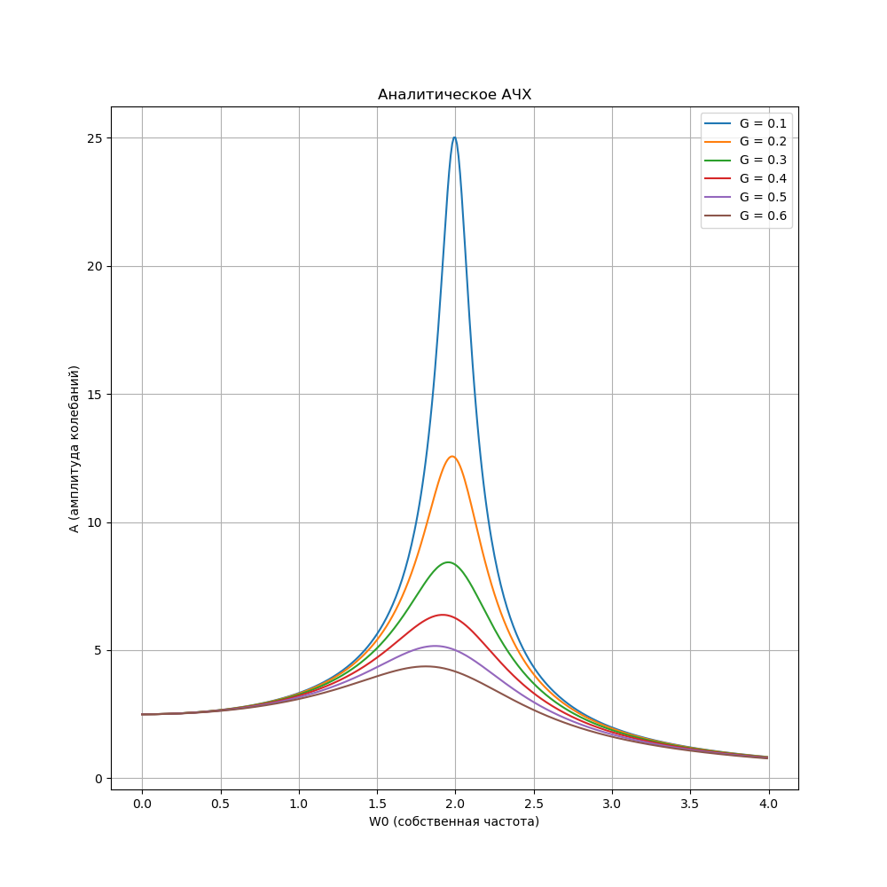

Полученная численным методом Рунге-Кутты АЧХ согласуется с аналитическим видом этой характеристики. Интересно, что при больших коэффициентах затухания максимум амплитуды смещается в сторону меньших частот, чем частота вынуждающей силы.


<a name="3"></a>
## Сравнение всех методов с точки зрения Закона Сохранения Энергии

### Удельная энергия

Следующий график показывает, что энергия в случае *метода Эйлера* быстро возрастает, а *метод Хойна* неотличим от аналитического решения.

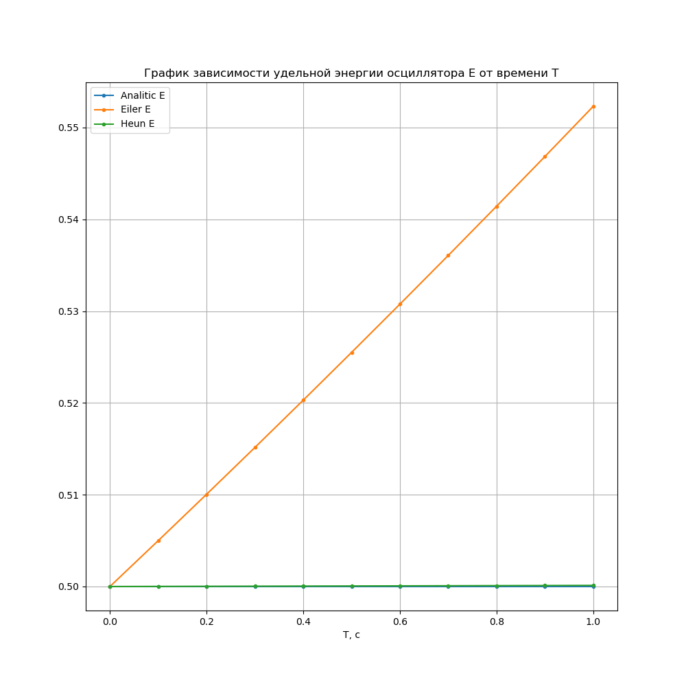

Но убрав решение Эйлера можно заметить, что хоть и не значительно, но в *методе Хойна* энергия также возрастает со временем, чего в реальной жизни быть не может. Но в *аналитическом решении* также прослеживается обман: энергия совсем не убывает, что также невозможно из-за присутствия сил сопротивления.

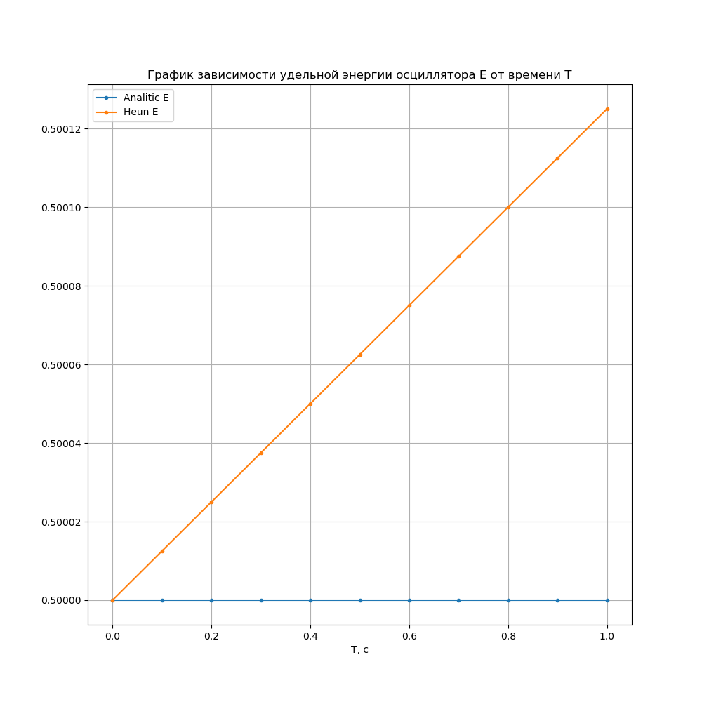

В случае *метода Рунге-Кутты* энергия не увеличивается, а уменьшается, что также противоречит закону сохранения энергии.

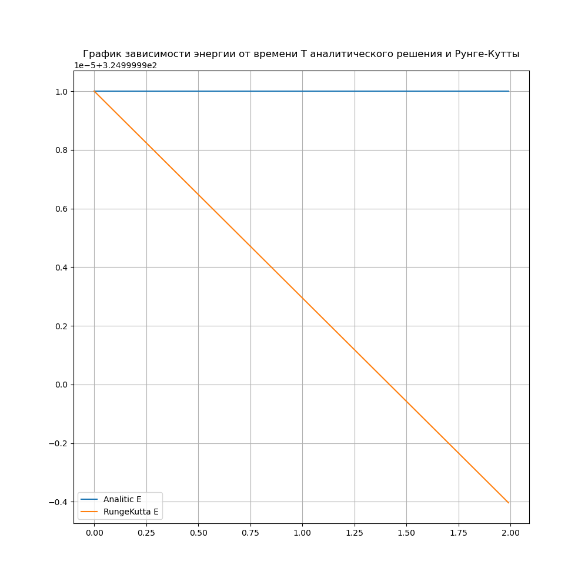

**Таким образом, никакой из численных методов решения уравнений движения, рассмотренных здесь, не способен удовлетворить ЗСЭ.**

<a name="4"></a>
## Запуск

> 1.Запуск начинается с прогрмаммы **StartSim.py**. Она собирает и запускает программу **Simulator**. 

> 2.**Simulator** принимает конфигурационный файл **Cfg.json**, на основании которого рассчитывает траекторию, после чего записывает результаты в бинарный файл и завершает работу. 

> 3.Затем **StartSim.py** считывает результаты симуляции и интерпретирует их в график. 

#### Пример конфигурационного файла

**Cfg.json:**

```
{
  "Model": "MathWithDriv",
  "Solver": "RungeKutta",
  "W": 5,
  "G": 0.5,
  "F": 1,
  "W0": 2,
  "T0": 0,
  "X0": 5,
  "V0": 5,
  "Start": 0,
  "Stop": 7,
  "Step": 0.01
}
```

, где 

**Model** - одна из возможных моделей осциллятора:

* "Math"
* "Phys"
* "MathWithFric"
* "MathWithDriv"

**Solver** - один из возможных методов решения дифференциального уравнения модели:

* "Analitic"
* "Eiler"
* "Heun"
* "RungeKutta"

**W** - собственная круговая частота осциллятора;

**G** - коэффициент затухания;

**F**, **W0** - амплитуда и частота гармонической вынуждающей силы;

**T0** - момент времени, в который заданы начальные условия;

**X0** - начальная координата;

**V0** - начальная скорость;

**Start** - момент врмени, начиная с которого строится траектория;

**Stop** - момент времени, до которого строится траектория;

**Step** - шаг по времени, для построения траектории численными методами (Эйлера, Хойна, Рунге-Кутты).

---------------------------------------------------------------------------------------------
**Путь до файла и его название должны быть в параметре запуска**

* В директории **HarmonicSimulator**:

```
python StartSim.py ../Configs/Cfg.json 
```

* Выведется график зависимости координат маятника (**X, U**) от времени **Т**.

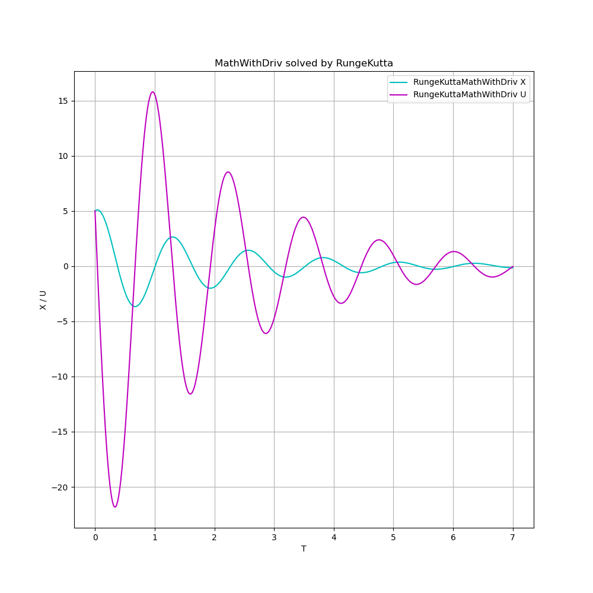

### Удачного развлечения!  :)

