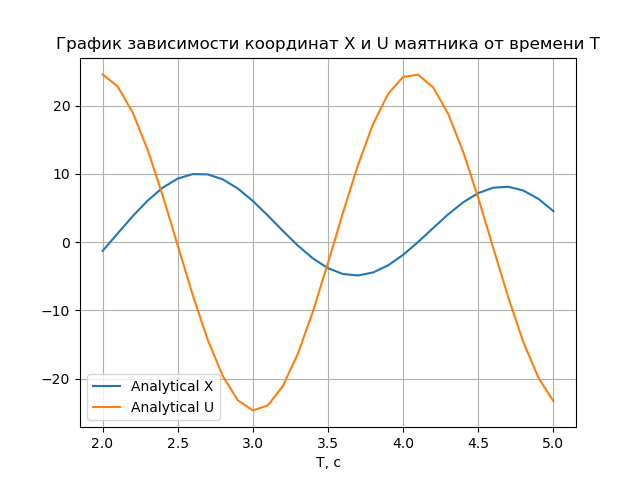

# Симулятор гармонических колебаний

> *Входные данные:* **Начальные условия маятника и промежуток времени движения**


>*Выходные данные:*  **Траектории движения маятника, изображенные на графике** 

**Траектории рассчитываются**

* **Аналитически**
* **Методом Эйлера**

 
 
## Методы решения

#### 1. Аналитический

> *Аналитическое решение уравнения колебаний*

**Уравнение колебаний**

В общем случае на маятник могут действовать вынуждающие силы и силы вязкого трения, поэтому все уравнения движения маятника представимы в виде диффура второго порядка:

**$$A \ddot{X} + B \dot{X} + Cx + D = 0$$**
 
Частным случаем движения являются **гармонические колебания** описываемые следующим уравнением:

**$$\ddot{X} + \omega^2X = 0$$**
 
где $$\omega^2 = \frac{C}{A} , \omega -$$ частота колебаний осциллятора.

Для решения удобно сделать замену $$\dot{X} = V$$ и выражать ответ в виде зависимости координаты **X** и скорости **V** от времени **T**.
 
**Общий вид решения гармонических колебаний:**


**$$X = C_1 cos(\omega T) + C_2 sin(\omega T),$$**

**$$V = - C_1 \omega sin(\omega T) + C_2 \omega cos(\omega T)$$**

 
где постоянные зависят от начальных условий: $$C_1 = X_0, C_2 = \frac{V_0}{X_0},$$ 


**Расчет и изображение траектории**

Для заданных начальных условий и промежутка времени
$$\omega$$ | $$X_0$$ | $$V_0$$ | $$T_1$$ | $$T_2$$ | $$\delta{T}$$ 
------|:--------:|------|:--------:|---------|:--------:|
3    | 3     | 23  | 2 | 5 | 0.1


Траектория имеет следующий вид:




#### 2. Метод Эйлера

> *В работе*

## Запуск

> Запуск начинается с прогрмаммы **make.py**. Она собирает и запускает программу **Simulator**. **Simulator** написан на С++, он принимает начальные данные и рассчитывает траекторию, после чего записывает результаты в бинарный файл и завершает работу. Затем **make.py** считывает результаты симуляции и интерпретирует их в график. 

* В директории **HarmonicSimulator**:

```
python make.py
```
* Затем будет предложено ввести начальные условия и выведется график зависимости координат маятника (**X, U**) от времени **Т**.
