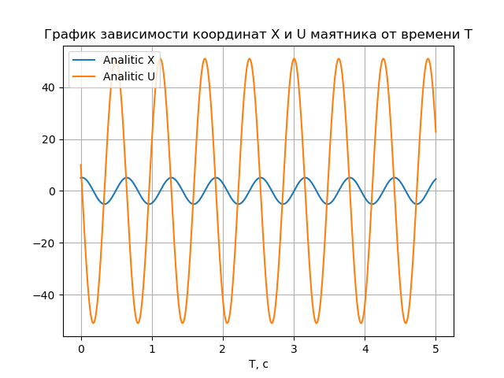

# Симулятор гармонических колебаний

> *Входные данные:* **Начальные условия маятника и промежуток времени движения**


>*Выходные данные:*  **Траектории движения маятника, изображенные на графике** 

**Траектории рассчитываются**

* *Аналитически*
* *Методом Эйлера*
* *Методом Хойна*

 
## Методы решения

#### 1. Аналитический

> *Аналитическое решение уравнения колебаний*

**Уравнение колебаний**

В общем случае на маятник могут действовать вынуждающие силы и силы вязкого трения, поэтому все уравнения движения маятника представимы в виде диффура второго порядка:

**$$A \ddot{X} + B \dot{X} + Cx + D = 0$$**
 
Частным случаем движения являются **гармонические колебания** описываемые следующим уравнением:

**$$\ddot{X} + \omega^2X = 0$$**
 
где $$\omega^2 = \frac{C}{A} , \omega -$$ частота колебаний осциллятора.

Для решения удобно сделать замену $$\dot{X} = V$$ и выражать ответ в виде зависимости координаты **X** и скорости **V** от времени **T**.
 
**Общий вид решения гармонических колебаний:**


**$$X = C_1 cos(\omega T) + C_2 sin(\omega T),$$**

**$$V = - C_1 \omega sin(\omega T) + C_2 \omega cos(\omega T)$$**

 
где постоянные зависят от начальных условий: $$C_1 = X_0, C_2 = \frac{V_0}{X_0},$$ 


**Расчет и изображение траектории**

Для заданных начальных условий и промежутка времени
$$\omega$$ | $$X_0$$ | $$V_0$$ | $$T_1$$ | $$T_2$$ | $$\Delta{T}$$ 
------|:--------:|------|:--------:|---------|:--------:|
10    | 5     | 10  | 0 | 5 | 0.01


Траектория имеет следующий вид:




#### 2. Метод Эйлера

> *Итерационный метод решения задачи Коши*

Учитывая исходное уравнение движения:

**$$\ddot{X} + \omega^2X = 0$$**

И замену $$\dot{X} = V$$

Приходим к системе уравнений вида:

**$$\dot{X} = V$$**
**$$\dot{V} = - \omega^2 X$$**


**Общий вид решения**

Для вывода данного метода, воспользуемся разложением функций **X(t)** и **V(t)** в ряд Тейлора:

**$$X(T + \Delta{T}) = X(T) + \dot{X}(T) \Delta{T} + o(\Delta{T})$$**

**$$V(T + \Delta{T}) = V(T) + \dot{V}(T) \Delta{T} + o(\Delta{T})$$**

Учитывая стремление $$o(\Delta{T})$$ к нулю при уменьшении шага по времени и систему уравнений для производных, приходим к системе вида:

**$$X(T + \Delta{T}) = X(T) + V(T)\Delta{T}$$**

**$$V(T + \Delta{T}) = V(T) -\omega^{2} X(T)\Delta{T}$$**

И таким образом, можно построить следующий итерационный процесс для вычисления координат в любой промежуток времени T при заданных начальных условиях.

**$$X_{i + 1} = X_{i} + V_{i}\Delta{T}$$**

**$$V_{i + 1} = V_{i} - \omega^{2} X_{i}\Delta{T}$$**


**Расчет и изображение траектории**

Для заданных начальных условий и промежутка времени
$$\omega$$ | $$X_0$$ | $$V_0$$ | $$T_1$$ | $$T_2$$ | $$\Delta{T}$$ 
------|:--------:|------|:--------:|---------|:--------:|
10    | 5     | 10  | 0 | 5 | 0.01


Траектория имеет следующий вид:


##### Сравнение методa с аналитическим решением


Для заданных начальных условий и промежутка времени
$$\omega$$ | $$X_0$$ | $$V_0$$ | $$T_1$$ | $$T_2$$ | $$\Delta{T}$$ 
------|:--------:|------|:--------:|---------|:--------:|
4    | 4     | 4  | 0 | 8 | 0.01

Видно, что метод Эйлера нарушает *закон сохранения энергии*. Амплитуда колебаний со временем возрастает, чего не может быть без добавления в систему энергии.


#### 3. Метод Хойна

> *Данный метод получается уточнением метода Эйлера, но дает более точные результаты*

**Общий вид решения**

Данный метод помогает численно интегрировать уравнения движения с помощью двухэтапного итерационного процесса на основе метода трапеций.

**Метод трапеций** - это среднее арифметическое между явнsм (i) и неявным (i + 1) методами Эйлера:


**$$X_{i + 1} = X_{i} + \frac{\Delta{T}}{2} (V_{i} + V_{i + 1})$$**

**$$V_{i + 1} = V_{i} - \frac{\Delta{T}}{2} \omega^{2} (X_{i} + X_{i + 1})$$**


Для получения метода Хойна, точные выражения координат на i + 1 - ом шаге заменяют на приближенные, найденные по методу Эйлера. Таким образом, получается двухэтапное вычисление на каждой итерации - **предиктор** и **корректор**:

*Предиктор:*

**$$X_{i + 1}^{'} = X_{i} + \Delta{T} V_{i}$$**

**$$V_{i + 1}^{'} = V_{i} - \Delta{T} \omega^{2} X_{i}$$**

*Корректор:*

**$$X_{i + 1} = X_{i} + \frac{\Delta{T}}{2} (V_{i} + V_{i + 1}^{'})$$**

**$$V_{i + 1} = V_{i} - \frac{\Delta{T}}{2} \omega^{2} (X_{i} + X_{i + 1}^{'})$$**


**Расчет и изображение траектории**

Для заданных начальных условий и промежутка времени
$$\omega$$ | $$X_0$$ | $$V_0$$ | $$T_1$$ | $$T_2$$ | $$\Delta{T}$$ 
------|:--------:|------|:--------:|---------|:--------:|
10    | 5     | 10  | 0 | 5 | 0.01


Траектория имеет следующий вид:


##### Сравнение метода с аналитическим решением

Для заданных начальных условий и промежутка времени
$$\omega$$ | $$X_0$$ | $$V_0$$ | $$T_1$$ | $$T_2$$ | $$\Delta{T}$$ 
------|:--------:|------|:--------:|---------|:--------:|
5   | 5     | 5  | 0 | 2 | 0.01


В данном методе отсутствует проблема с *законом сохранения энергии* и решения практически совпадают.


Даже на больших временах ($$T_2 = 15$$), удивительно!


##### Сравнение метода с методом Эйлера

Для заданных начальных условий и промежутка времени
$$\omega$$ | $$X_0$$ | $$V_0$$ | $$T_1$$ | $$T_2$$ | $$\Delta{T}$$ 
------|:--------:|------|:--------:|---------|:--------:|
4    | 4     | 4  | 0 | 8 | 0.01

Не смотря на то, что метод Хойна строится на основе метода Эйлера, расхождения между ними значительны. 


#### 4. Сравнение всех методов

Для заданных начальных условий и промежутка времени
$$\omega$$ | $$X_0$$ | $$V_0$$ | $$T_1$$ | $$T_2$$ | $$\Delta{T}$$ 
------|:--------:|------|:--------:|---------|:--------:|
4    | 4     | 4  | 0 | 8 | 0.01


Теперь рассмотрим поближе:


На этом графике видно, что метод Хойна для скорости (коричневая линия) в точности дает среднее между методом Эйлера в нулевой момент времени (красная линия) и первый момент времени, так как по истечении двух тактов, они соединились в одной точке. Это выполнено лишь в начальный момент времени при условии нулевой начальной координаты.

Для координат эта же зависимость наблюдается при нулевой начальной скорости. На следующем графике видно, что скорость изменения координаты Хойна (фиолетовая линия) в первые два такта в точности равна средней между координатами Эйлера (зеленая линия) в нулевой и первый моменты.


##### Удельная энергия

Следующий график показывает, что энергия в случае метода Эйлера быстро возрастает, а аналитическое решение неотличимо от метода Хойна.


Но убрав решение Эйлера можно заметить, что хоть и не значительно, но в методе Хойна энергия также возрастает со временем, чего в реальной жизни быть не может. Но в аналитическом решении также прослеживается обман: энергия совсем не убывает, что также невозможно из-за присутствия сил сопротивления.


## Запуск

> Запуск начинается с прогрмаммы **make.py**. Она собирает и запускает программу **Simulator**. **Simulator** написан на С++, он принимает начальные данные и рассчитывает траекторию, после чего записывает результаты в бинарный файл и завершает работу. Затем **make.py** считывает результаты симуляции и интерпретирует их в график. 

* В директории **HarmonicSimulator**:

```
python make.py
```
* Затем будет предложено ввести начальные условия и выведется график зависимости координат маятника (**X, U**) от времени **Т**.

