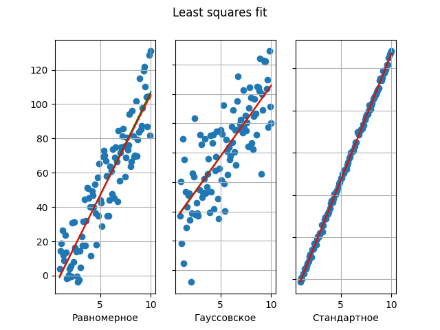

# Построение графиков в Python


 
### Фигуры Лиссажу

> *В зависимости от угла Alpha и соотношения между частотами (nuX и nuY)*

Координаты задаются формулами (t пробегает от 0 до 2pi):

 ```
x = A * sin(nuX * t)
y = B * sin(nuY * t + Alpha)

 ```


  
### Распределение узловых точек


> *Гистограмма показывает количество узловых точек (пересечений) на фигуре Лиссажу для координаты х*


### Метод наименьших квадратов

> **Least squares fit** - математический метод, применяемый для решения различных задач, основанный на минимизации суммы квадратов отклонений некоторых функций от экспериментальных входных данных.




> *Приближение линейной функцией (красный график) по массиву точек {x, y} (зеленый график)*


Множествa точек сгенерированы по заданной линейной функции Y = A \* X + B с добавлением случайной ошибки с помощью numpy.random с заданными распределениями:


* Pавномерным - **np.random.uniform()**
* Гауссовским с параметрами - **np.random.normal()**
* Стандартным нормальным - **np.random.standard_normal()**
